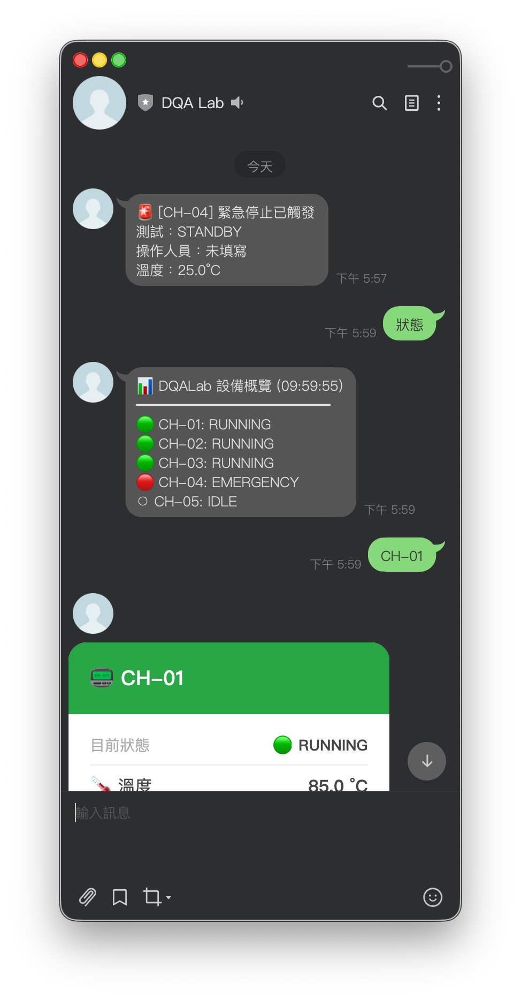
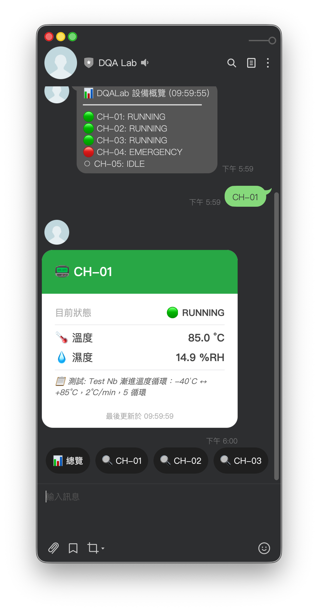

# DQA Lab Digital Twin


> **Environmental test lab management platform** built with FastAPI + React.
> Automates SOP execution, ISO 17025 report generation, fixture tracking, and AI-assisted scheduling for temperature/humidity chambers.
>
> - 78 built-in test conditions across 5 international standards (IEC 60068 / EN 50155 / IEC 61850-3 / IEC 60945 / DNV)
> - GUM-compliant measurement uncertainty analysis (Type A/B → U, k=2)
> - AI advisor (Gemini + RAG) — recommend conditions → one-click scheduling
> - LINE Bot integration for emergency alerts
>
> [Demo Video](#demo) · [中文說明如下](#核心功能)

基於 FastAPI + React 的環境測試實驗室數位孿生平台，整合設備模擬引擎、SOP 執行管理、治具借還追蹤與 AI 法規諮詢，目標取代實驗室紙本作業流程。

---

## Demo

https://github.com/user-attachments/assets/f9d30698-6526-4770-a678-4bf9373e334c

---

## 核心功能

| 模組 | 功能摘要 |
|------|---------|
| 🖥️ **控制中心** | 多台溫箱即時監控（溫濕度、狀態、倒數計時）；左側欄依分頁顯示排程概況 / 治具摘要 / 人員摘要 |
| 🔧 **SOP 執行引擎** | 三步驟選法規 → 版本 → 條件，步驟自動確認、admin 手動接管、ISO 17025 報告下載（CSV + PDF） |
| 📊 **量測不確定度** | GUM 合規自動計算：Type A（穩定段重複測量）＋ Type B（感測器解析度）→ 組合 uc → 擴充 U（k=2, 95%），輸出於 PDF 報告 Section 5 |
| 🗄️ **治具借還管理** | 借出 / 歸還 / 逾期追蹤、損壞遺失清單、月盤點、採購閉環、Excel 批次匯入；排程聯動（預約→自動借出→自動歸還） |
| 🤖 **AI 法規諮詢** | 自然語言查詢、RAG 法規檢索、多輪對話（支援「加上/再加」累積推薦條件）；推薦測試後可直接「📅 申請此測試」預填排程；右下角 FAB 浮動按鈕，點擊從右側滑入 |
| 🗓️ **排程系統** | 甘特圖永遠可見（固定區塊）、自動排程（排除超時卡機 / EMERGENCY 設備）、審核前即時預覽時段、不可用時段管理；排程確認後 APScheduler date job 精確觸發啟動（每 5 分鐘 fallback）；條件銜接改為人員確認制；確認後治具自動預約 |
| 🚨 **LINE Bot 通知** | 條件完成（等待人員確認）、全部完成、緊急停止 — 主動推播給管理者個人 |
| 👥 **人員管理** | 人員名冊（左）+ 訪客 Token 管理（右）；Token 表支援「隱藏已失效」一鍵過濾 |
| 🔐 **存取控制** | 管理員登入 + 訪客唯讀模式，bcrypt 密碼雜湊，IP Rate Limiting |

 

---

## 支援的國際測試標準

內建 **78 項精確測試條件**：

| 標準 | 版本 | 涵蓋項目 | 條件數 |
|------|------|---------|--------|
| **IEC 60068** | 2-1、2-2、2-14、2-30、2-78 | 冷測、乾熱、溫度循環、濕熱循環 | 24 |
| **EN 50155** | 2017、2007 | 高低溫、隧道溫變、濕熱循環、高溫通電 | 18 |
| **IEC 61850-3** | Ed.2:2013、Ed.1:2002 | 乾熱、冷測、濕熱、高溫高濕穩態 | 15 |
| **IEC 60945** | 2002 | 乾熱儲存/工作、濕熱、低溫儲存/工作 | 12 |
| **DNV** | CG-0339:2015、Std.Cert.2.4 | 穩態/循環濕熱、乾熱 | 9 |

> ⚠️ 系統參數僅供開發驗證，實際測試應以原始法規文件為準。

---

## 快速啟動

**前置需求：** Python 3.13+、Node.js 18+、macOS / Linux / WSL2

```bash
make install                  # 安裝所有依賴
python backend/init_db.py     # 初始化資料庫（首次執行）
make dev                      # 啟動全部服務
make test                     # 執行後端測試
```

| 服務 | 網址 |
|------|------|
| 前端 | http://localhost:5173 |
| 後端 API | http://localhost:8000 |
| API 文件 | http://localhost:8000/docs |

複製專案根目錄的 `.env.example` 為 `backend/.env`（後端啟動時讀取）：

```bash
cp .env.example backend/.env
```

**必須設置（可選功能會自動跳過）：**
- `GEMINI_API_KEY` — [Google AI Studio](https://aistudio.google.com) 免費申請（Embedding + Flash-Lite）
- `LINE_CHANNEL_SECRET`、`LINE_CHANNEL_ACCESS_TOKEN` — LINE Developers 後台取得（推播功能）

**可選（RAG 對比測試）：**
- `RAG_EMBED_PROVIDER=gemini`（預設）或 `sentence_transformers`
- `RAG_ST_MODEL=intfloat/multilingual-e5-small`（僅 sentence-transformers 模式）

---

## 技術堆棧

| 層級 | 技術 |
|------|------|
| **後端** | FastAPI、SQLAlchemy 2.0、SQLite、Alembic、APScheduler |
| **前端** | React 19、Vite、Recharts、Axios、react-router-dom |
| **AI** | Gemini API（Flash-Lite）+ 可切換 RAG Embedding（Gemini / sentence-transformers） |
| **通知** | LINE Messaging API（條件完成 / 測試完成 / 緊急停止推播）|

---

## 系統架構

```
瀏覽器（React 19）
    │  HTTP / Axios
    ▼
FastAPI（後端）
    ├── SQLite（SQLAlchemy 2.0 + Alembic）
    ├── 物理模擬引擎（sim_phase 狀態機，APScheduler 精確排程觸發）
    ├── AI 諮詢（Gemini Flash-Lite + RAG Embedding）
    └── LINE Messaging API（Webhook 接收 + push_message 推播）
```

資料流向：
```
AI 推薦條件 → [申請此測試] → 排程確認 → 治具預約
                                    ↓
                              SOP 自動啟動
                                    ↓
                     治具借出 → 測試完成 → 治具歸還 + PDF 報告
```

---

## 後續規劃

- [ ] RS-485 真實設備通訊（Phase 3）

---

## Contributing

本專案目前為個人作品集專案，暫不接受外部 PR。

若有問題或功能建議，歡迎開 Issue 討論。商業合作或授權需求請透過 GitHub 聯絡作者。

---

## 授權

[AGPL-3.0 License](./LICENSE)

本專案採用 AGPL-3.0 授權。若需商業授權，請聯絡作者。
