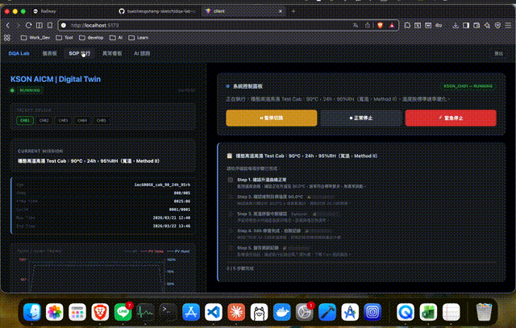
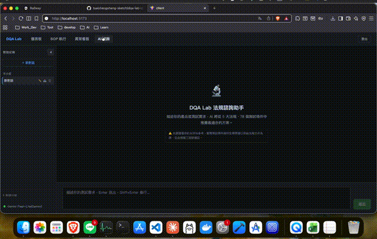
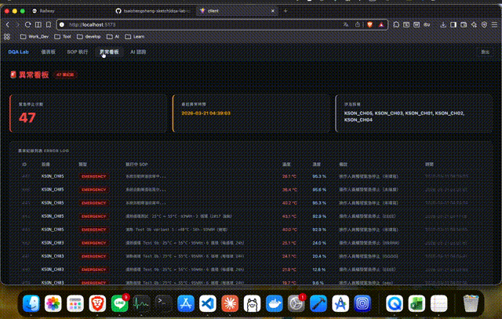

# DQA Lab Digital Twin


基於 FastAPI + React 的實驗室數位孿生平台，整合物理模擬引擎與國際環境測試標準，實現溫箱設備的遠端自動化控制與 AI 法規諮詢。

---

## 為什麼要做這個專案

### 核心痛點

工業環境測試涉及眾多國際標準（IEC 60068、EN 50155 等），測試人員在執行時必須：
- **手動查閱法規文件** — 每次選擇條件都要對照 PDF，容易出錯
- **重複進行相同計算** — 溫度斜率、保溫時間、循環次數的轉換沒有自動化
- **處理新人培訓成本** — 理解標準版本差異、測試流程需要 2-4 週培訓
- **等待硬體可用性** — 硬體故障或排期時無法繼續開發驗證

### 解決思路

不僅是「數位化流程」，而是打造一個**知識庫 + 模擬引擎**的完整體系：
1. 內建 78 項精確測試條件，消除手動查閱
2. 設備狀態機 + 物理模擬引擎，支援離線驗證
3. AI 法規助手，用自然語言快速檢索與比較標準
4. 完整記錄（ISO 17025 格式），保證可追溯性

---

## 核心功能

### 📊 實時監控儀表板
即時監控多台溫箱設備，獨立顯示各設備的溫濕度、運行狀態及倒數計時。採用雙 Y 軸趨勢圖展示完整多週期低溫循環模擬（實際時間壓縮展示），六種顏色狀態機指示（Idle / Running / Paused / Finishing / Emergency / Error），支援設備熱切換時自動更新數據。

### 🔧 SOP 執行引擎
測試人員透過三步驟——選擇法規 → 選擇版本 → 選擇測試條件——自動載入對應參數。系統支援：
- **進度持久化**：伺服器重啟後自動還原執行進度
- **步驟鎖定機制**：防止誤操作，已完成步驟無法倒退
- **即時波形疊加**：SP（設定點）+ PV（實際溫度）實時展示，直觀對比預期與實際
- **標準化報告**：執行完成自動儲存紀錄，支援 ISO 17025 相容格式下載

### 🤖 AI 法規諮詢助手
支援自然語言查詢，透過 RAG（檢索增強生成）精準檢索法規內容。用戶可以詢問「EN 50155 和 IEC 60068 的濕熱循環有什麼差異？」，系統委託 Gemini API 進行推理與對比。對話歷史在本機完全持久化（localStorage + 資料庫），支援多輪長上下文推理，無本地上傳痕跡。

### 🚨 異常與通知系統
緊急停止和測試完成時自動推播至 LINE，包含設備名稱、當前進度、完成時間。異常紀錄包含步驟進度與時間戳，支援事後原因分析。實作 EMERGENCY 狀態防重複觸發機制。

### 🔐 多層存取控制
- 前端密碼保護 + Session（8 小時自動過期）
- 後端 IP Rate Limiting（5 次失敗後 10 分鐘內封鎖）
- X-Demo-Password header 驗證
- CORS 環境變數控制，支援多環境部署

---

## 支援的國際環境測試標準

本系統內建以下國際環保測試標準，涵蓋工業控制、鐵道、海事、變電站等領域，共計 **78 項精確測試條件**：

| 標準 | 版本 | 涵蓋測試項目 | 條件數 |
|------|------|------------|--------|
| **IEC 60068** | 2-1、2-2、2-14、2-30、2-78 | 冷測 (Ab/Ad)、乾熱 (Ba/Bb)、溫度循環 (Na/Nb)、濕熱循環 (Db) | 24 |
| **EN 50155** | 2017、2007 | OT1~OT6 高低溫、隧道溫度變化、濕熱循環、高溫通電 | 18 |
| **IEC 61850-3** | Ed.2:2013、Ed.1:2002 | Class C1/C2/C3 乾熱、冷測、濕熱、高溫高濕穩態 | 15 |
| **IEC 60945** | 2002 | 乾熱儲存/工作、濕熱、低溫儲存/工作 | 12 |
| **DNV** | CG-0339:2015、Std.Cert.2.4 | Class A/B/C/D 穩態/循環濕熱、乾熱 | 9 |

> ⚠️ **免責聲明**  
> 系統內建參數僅供初步評估與開發驗證之用。實際認證測試條件應以原始法規文件為準，並由授權工程師負責確認與簽核。

---

## 技術亮點

### 🏗️ 系統架構

#### 狀態機設計
採用**分層狀態機**，使複雜的測試流程邏輯清晰可控：

```
設備狀態層：IDLE ↔ RUNNING ↔ PAUSED → FINISHING → IDLE
             ↓ (任意)
          EMERGENCY (防重複觸發機制)

模擬相位層：idle → ramp_to_low/ramp_to_high → dwell_high 
         → ramp_to_low2 → dwell_low → ramp_to_ambient
```

狀態轉移嚴格控制，防止無效操作。EMERGENCY 觸發時自動記錄當前進度（已完成步驟數 / 總步驟數），便於事後復盤。

#### 物理模擬引擎
自主實現的溫度模擬器，支援：
- **真實時間戳計時**：dwell（保溫）階段使用絕對時間戳，避免時間誤差累積
- **多週期循環**：支援完整 Na / Nb / Db 等多循環測試
- **伺服器重啟恢復**：狀態持久化至資料庫，重啟後自動繼續執行
- **實時波形計算**：SP（設定點）根據現在時刻動態計算，支援「時間壓縮」線性展示

#### RAG 檢索策略
AI 法規諮詢的核心——精準的知識檢索：

**向量化**：啟動時以 Gemini Embedding 批次向量化（20 條/批，批次間隔 5 秒），結果快取至本地 pickle 檔案，避免重複調用 API。

**多維檢索策略**：
- 明確指定標準 → 直接檢索該標準條件
- 跨標準比較詢問 → 並行檢索多標準，整合對比
- 有測試類型關鍵字（如「濕熱循環」）→ 向量相似度搜尋 + 關鍵字篩選
- 其他通用詢問 → top-k=20 向量檢索

**智能上下文**：未指定標準時，自動從對話歷史抓取之前提過的標準；無法推斷時預設推薦 IEC 60068（最通用標準）。

#### 前端性能優化
輪詢策略分級：

| 元件 | 頻率 | 優化策略 |
|------|------|---------|
| Dashboard 設備狀態 | 10s | 隱藏時暫停，避免背景耗電 |
| Dashboard 執行紀錄 | 60s | 隱藏時暫停，減輕 DB 壓力 |
| SOPPage 設備狀態 | 3s | 使用者在操作時需快速反饋 |
| ErrorLog | 60s | 異常日誌更新頻率低 |

### 🔐 安全與存取控制設計

**分層驗證**：
1. 前端：localStorage 存 session（密碼 + 登入時間戳），8 小時自動踢出
2. 後端：X-Demo-Password header 驗證，豁免路徑（health check、LINE webhook）
3. IP Rate Limiting：內存快取，5 次失敗後 10 分鐘封鎖該 IP

**防禦設計**：
- CORS 環境變數控制，支援多環境隔離
- 401 錯誤時前端自動清除 session、跳回登入頁（axios interceptor）
- 無明文密碼儲存，僅驗證 header 值

### 📊 資料庫設計

採用 SQLAlchemy ORM + Alembic 遷移管理：

| 表格 | 用途 | 索引 |
|------|------|------|
| `device_data` | 溫濕度歷史（每 10 秒採樣） | (device_id, timestamp) |
| `device_states` | 設備狀態持久化（sim_phase、sim_cycle、started_at） | device_id |
| `sop_executions` | 執行主表（法規、版本、操作人員） | id, created_at |
| `step_records` | 步驟完成狀態（防止倒退） | execution_id, step_index |
| `error_logs` | EMERGENCY 事件（含進度快照） | device_id, created_at |

時間序列數據使用複合索引，查詢效率 O(log n)。

### 🎯 AI 推理配置

- **推理模型**：Gemini 2.5 Flash-Lite（溫度 0.3，確保答案穩定）
- **免費額度**：1000 次/天，支援個人開發與小團隊測試
- **本地快取**：知識庫向量化結果快取至 pickle，啟動後無額外 API 調用
- **多輪對話**：localStorage 本機儲存，支援長上下文推理（MAX_HISTORY = 4）

---

## 功能演示

### 核心功能一覽
- **儀表板**：多設備實時監控、雙軸趨勢圖、狀態管理
- **SOP 執行**：三步驟法規選擇、波形曲線即時疊加、執行紀錄儲存
- **AI 法規諮詢**：自然語言查詢、精準檢索、串流回答
- **異常處理**：緊急停止、LINE 推播通知、詳細日誌

### 實機畫面

**儀表板 — 多設備即時監控**


**SOP 執行 — 法規與條件選擇**


**AI 法規諮詢 — 串流逐字回答**


**異常紀錄 — 事件追蹤**


---

## 技術堆棧

| 層級 | 採用技術 | 為什麼選這個 |
|------|---------|------------|
| **後端** | FastAPI、SQLAlchemy 2.0、SQLite、Alembic、asyncio | 非同步性能、自動 API 文件、ORM 遷移管理、輕量級部署 |
| **前端** | React 18、Vite、Recharts、Axios | 元件化、快速開發、高效渲染、實時圖表 |
| **AI 引擎** | Gemini API (Embedding + Flash-Lite)、in-memory RAG | 低成本向量化、高質量推理、免費額度足夠小團隊用 |
| **通知系統** | LINE Messaging API | 即時通知、與開發者習慣無縫整合、易於自動化 |
| **環境要求** | Python 3.9+、Node.js 18+、macOS/Linux/WSL2 | 跨平台、無依賴環境 |

---

## 快速啟動

### 前置需求
- Python 3.9+
- Node.js 18+
- macOS / Linux / WSL2

### 安裝與啟動

```bash
# 1. 安裝所有依賴
make install

# 2. 初始化資料庫（首次執行）
python backend/init_db.py

# 3. 啟動全部服務（後端、前端、模擬器）
make dev
```

### 本地服務網址

| 服務 | 網址 | 說明 |
|------|------|------|
| 前端 | http://localhost:5173 | React 使用者介面 |
| 後端 API | http://localhost:8000 | FastAPI 伺服器 |
| API 文件 | http://localhost:8000/docs | Swagger 互動式文件 |
| ngrok 面板 | http://localhost:4040 | LINE Webhook 除錯 |

### 環境變數設定

在 `backend/.env` 中設定（使用 `.env.example` 作為範本）：

```bash
# 必須設定
DEMO_PASSWORD=your_password_here

# AI 諮詢功能（可選，無此設定時系統仍可正常運作）
GEMINI_API_KEY=your_gemini_api_key

# LINE Bot 推播（可選）
LINE_CHANNEL_SECRET=your_secret
LINE_CHANNEL_ACCESS_TOKEN=your_token
LINE_USER_ID=your_user_id

# 資料庫
DATABASE_URL=sqlite:///./dqa_lab.db

# CORS 設定（本地預設為 http://localhost:5173）
ALLOWED_ORIGINS=http://localhost:5173
```

### 常見問題

**Q: 啟動時出現 `alembic` 相關錯誤**  
A: 執行 `python backend/init_db.py` 初始化資料庫

**Q: LINE Bot 推播無反應**  
A: 重新開啟終端機，重新執行 `make dev`（ngrok URL 會重新生成）

**Q: 前端無法連線後端**  
A: 確認 `backend/.env` 中的 `ALLOWED_ORIGINS` 設定是否正確

---

## 專案結構

```
dqa-lab-digital-twin/
├── backend/
│   ├── app/
│   │   ├── standards/        # 國際標準測試條件庫
│   │   │   ├── __init__.py
│   │   │   ├── _base.py
│   │   │   ├── dnv.py
│   │   │   ├── en50155.py
│   │   │   ├── iec60068.py
│   │   │   ├── iec60945.py
│   │   │   └── iec61850.py
│   │   ├── models.py         # SQLAlchemy ORM 定義
│   │   ├── main.py           # FastAPI 路由 & 應用進入點
│   │   ├── sop.py            # SOP 執行邏輯
│   │   ├── ai.py             # Gemini 推理整合
│   │   ├── rag.py            # RAG 向量檢索 & 智能標準推薦
│   │   ├── auth.py           # 存取控制（密碼驗證、Rate Limiting、Session）
│   │   ├── line.py           # LINE Messaging API 推播（Flex Message 支援）
│   │   ├── reports.py        # ISO 17025 相容 CSV 報告生成
│   │   ├── serial_reader.py  # RS-485 串列通訊（Phase 3 準備）
│   │   ├── errors.py         # 自訂例外類別定義
│   │   └── utils.py          # 工具函式（時間計算、日期格式化等）
│   ├── alembic/              # 資料庫遷移管理
│   │   ├── versions/         # 遷移指令碼
│   │   ├── env.py
│   │   ├── script.py.mako
│   │   └── README
│   ├── alembic.ini           # Alembic 配置
│   ├── init_db.py            # 資料庫初始化腳本
│   ├── rag_cache.pkl         # RAG 向量化快取（本地儲存）
│   ├── requirements.txt       # Python 套件依賴
│   └── .env.example          # 環境變數範本
├── client/                   # React 前端應用
│   ├── src/
│   │   ├── ai/               # AI 諮詢元件（獨立資料夾）
│   │   │   ├── ChatArea.jsx
│   │   │   ├── ChatSidebar.jsx
│   │   │   ├── MessageBubble.jsx
│   │   │   ├── useAIChat.jsx
│   │   │   └── aiStorage.jsx # localStorage 操作（純函式）
│   │   ├── components/
│   │   │   └── sop/          # SOP 執行元件（10 個子元件）
│   │   │       ├── ConditionCard.jsx
│   │   │       ├── ControlPanel.jsx
│   │   │       ├── ExecutionInfoPanel.jsx
│   │   │       ├── ExecutionPanel.jsx
│   │   │       ├── generateSP.js
│   │   │       ├── MonitorSide.jsx
│   │   │       ├── SafetyChecklist.jsx
│   │   │       ├── SelectGroup.jsx
│   │   │       ├── StepList.jsx
│   │   │       └── TempChart.jsx
│   │   ├── assets/
│   │   ├── AIPage.jsx
│   │   ├── api.js            # Axios 實例 + 認證攔截器（401 自動登出）
│   │   ├── App.jsx           # 路由 & Session 管理
│   │   ├── Dashboard.jsx
│   │   ├── ErrorLog.jsx
│   │   ├── SOPPage.jsx
│   │   ├── main.jsx
│   │   ├── App.css
│   │   ├── SOPPage.css
│   │   └── index.css
│   ├── index.html
│   ├── package.json
│   ├── package-lock.json
│   ├── vite.config.js
│   ├── eslint.config.js
│   └── vercel.json           # Vercel 部署配置
├── simulator/                # 溫箱物理模擬引擎
│   ├── main.py              # 模擬器主程式（狀態機、波形計算、時間戳管理）
│   └── requirements.txt      # 模擬器環境依賴
├── docs/                     # 文檔與演示檔案
│   ├── templates/
│   │   └── QA_Test_Report_Template.docx
│   ├── ai.gif、dashboard.gif、errorlog.gif、sop.gif  # 功能演示（壓縮）
│   └── ai.mov、dashboard.mov、errorlog.mov、sop.mov、demo.mov  # 原始錄製檔
├── AGENTS.md                 # AI 協作工具上下文（開發規範、技術規格）
├── dev_start.sh              # 快速啟動指令碼
├── Makefile                  # 便利指令
├── requirements.txt          # Python 套件依賴（彙總）
├── package.json              # Node 套件依賴（彙總）
├── LICENSE                   # MIT License
└── README.md
```

---

## 開發指南

### 資料庫結構變更

修改 `backend/app/models.py` 後，執行以下命令：

```bash
cd backend

# 自動生成遷移指令碼
alembic revision --autogenerate -m "變更描述"

# 應用遷移至資料庫
alembic upgrade head
```

### 前端元件開發

前端元件組織如下：
- `src/ai/` — AI 諮詢相關元件（獨立資料夾，包含 ChatArea.jsx、ChatSidebar.jsx、MessageBubble.jsx、useAIChat.jsx、aiStorage.jsx）
- `src/components/sop/` — SOP 執行相關元件（10 個子元件）
- 其他 — Dashboard、ErrorLog、AIPage、SOPPage、App 路由

### 常用指令

```bash
make install      # 安裝所有依賴（含 pip 和 npm）
make dev          # 啟動全部服務
make clean        # 清理殘留程序
```

---

## API 端點概覽

完整 API 文件請在本地運行後訪問 `http://localhost:8000/docs`。

主要端點包括：

- **設備控制**：實時狀態查詢、歷史數據檢索、進度更新
- **SOP 管理**：標準樹狀結構查詢、執行啟動、紀錄儲存
- **異常通知**：緊急停止、暫停/恢復、狀態轉移
- **AI 諮詢**：串流查詢端點、多輪對話
- **報告生成**：ISO 17025 相容格式 CSV 下載

---

## 貢獻指南

本專案為個人學習專案，歡迎提供建議或參考。如有任何想法或改進建議，請透過 GitHub Issues 聯繫。

---

## 授權

[MIT License](./LICENSE)

---

## 後續規劃

- **AI 治具管理助手**：根據測試條件自動推薦合適治具
- **AI 設備排程預估**：基於待測項目數量估算完整時間
- **Phase 3**：RS-485 真實設備通訊、治具資料庫、JWT 認證、步驟自動確認

---